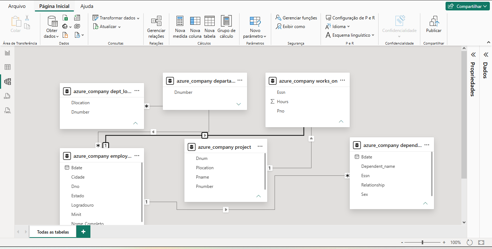
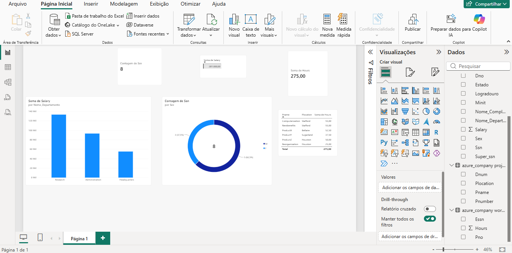

# desafio-powerbi-processando-transformando-dados
Desafio de Projeto DIO - Processando e Transformando Dados com Power BI e Azure MySQL.
# Desafio de Projeto DIO: Processando e Transformando Dados com Power BI

Este repositório contém a solução do desafio **"Processando e Transformando Dados com Power BI"** da Digital Innovation One (DIO). O objetivo foi realizar a extração, limpeza, transformação e modelagem em estrela (Star Schema) a partir de um banco de dados MySQL hospedado na nuvem Azure, finalizando com a criação de um dashboard executivo.

---

## 🛠️ Etapas do Projeto

### 1. Conexão e Transformação dos Dados (Power Query)
- Conexão do Power BI Desktop com a instância do banco de dados MySQL na Azure (`azure_company`).
- Tratamento e verificação dos dados dos colaboradores (`employee`):
  - Ajuste e padronização das colunas de endereço (Logradouro, Cidade, Estado).
  - Concatenação dos campos de nome para criação da coluna `Nome_Completo`.
  - Mesclagem das consultas para associação dos nomes dos departamentos aos colaboradores.

### 2. Modelagem de Dados (Esquema Estrela)
- Ajuste das relações entre as tabelas para eliminação de caminhos ambíguos e redundâncias fluindo entre Fatos e Dimensões.
- Mapeamento das relações $1:N$ ativas:
  - `dependent` $\rightarrow$ `employee`
  - `dept_locations` $\rightarrow$ `departament`
  - `employee` $\rightarrow$ `departament`
  - `works_on` $\rightarrow$ `employee`
  - `works_on` $\rightarrow$ `project`

---

## 📊 Modelo de Dados Diagramado

---

## 📈 Dashboard Executivo Final

O relatório contém visuais para análise rápida dos principais indicadores da empresa:
- **Cartões Principais:** Total de Colaboradores, Total da Folha Salarial e Total de Horas Alocadas em Projetos.
- **Gráfico de Colunas:** Distribuição Salarial por Departamento.
- **Gráfico de Rosca:** Proporção de Colaboradores por Sexo.
- **Tabela Detalhada:** Projetos, Localizações e Horas Trabalhadas.

---

## 📁 Arquivos no Repositório
- `*.pbix`: Arquivo do Power BI Desktop contendo as transformações, modelo e visuais.
- Imagens de suporte do modelo de dados e do dashboard.
